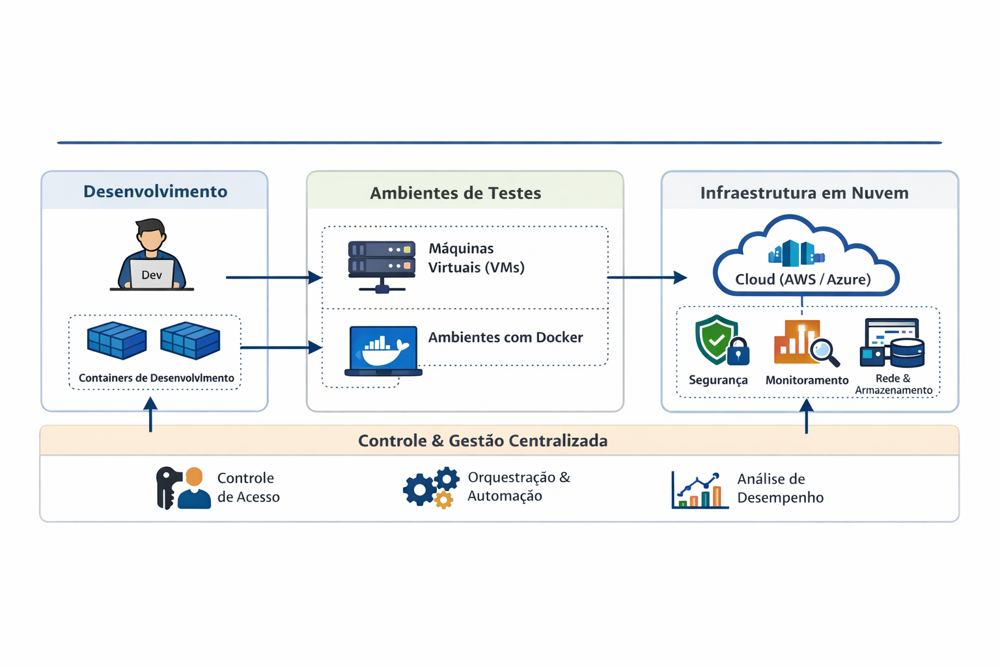

# RELATÓRIO DE PLANEJAMENTO DE INFRAESTRUTURA  
## Estudo de Caso I – Sistemas Operacionais  

---

**Aluno:** ______________________________________  
**Curso:** ______________________________________  
**Disciplina:** Sistemas Operacionais  
**Professor:** Prof. Me. Deivison S. Takatu  
**Data:** ____/____/______  

---

## 1. Introdução

A DevStore é uma startup voltada ao desenvolvimento de aplicações web que enfrenta desafios significativos relacionados à escalabilidade, organização e segurança de sua infraestrutura de Tecnologia da Informação. Atualmente, a empresa utiliza servidores locais sem qualquer tipo de padronização, o que dificulta tanto a manutenção dos sistemas quanto a expansão de suas operações.

Além disso, o processo de desenvolvimento ocorre diretamente nas máquinas dos desenvolvedores, sem a utilização de ambientes separados para testes e produção, bem como sem práticas estruturadas de versionamento e testes automatizados. Esse cenário aumenta consideravelmente os riscos de falhas, inconsistências e vulnerabilidades de segurança.

Diante desse contexto, o presente relatório tem como objetivo propor uma arquitetura de infraestrutura moderna, eficiente e escalável, fundamentada em conceitos de sistemas operacionais, virtualização, containerização e computação em nuvem.

---

## 2. Problemas Identificados

A análise do cenário atual da DevStore permite identificar diversos problemas estruturais. A ausência de padronização dos servidores dificulta o gerenciamento dos sistemas e gera inconsistências entre ambientes. A utilização exclusiva de servidores locais limita a escalabilidade, tornando o crescimento da empresa mais custoso e complexo.

Outro problema relevante é a inexistência de ambientes separados para desenvolvimento, testes e produção, o que compromete a qualidade das aplicações. A falta de testes automatizados e de um pipeline de integração contínua também contribui para o aumento de erros durante o desenvolvimento.

Adicionalmente, observa-se fragilidade nos mecanismos de segurança, uma vez que não há controle adequado de acesso, monitoramento contínuo ou políticas bem definidas de proteção de dados.

---

## 3. Objetivos da Solução

A proposta de solução tem como principal objetivo reestruturar a infraestrutura da DevStore de forma a torná-la mais organizada, segura e escalável. Busca-se implementar ambientes padronizados que garantam consistência no desenvolvimento e na execução das aplicações.

Outro objetivo fundamental é permitir a escalabilidade sob demanda, reduzindo a dependência de infraestrutura física e, consequentemente, os custos operacionais. Além disso, pretende-se aumentar o nível de segurança dos sistemas por meio da adoção de boas práticas, como controle de acesso, monitoramento e isolamento de ambientes.

---

## 4. Arquitetura Proposta

A arquitetura proposta baseia-se na integração de quatro tecnologias principais: virtualização, containerização, computação em nuvem e mecanismos de segurança.

A virtualização será utilizada para a criação de máquinas virtuais, especialmente em ambientes de testes, permitindo maior isolamento entre sistemas e garantindo maior segurança na execução das aplicações. No entanto, reconhece-se que essa abordagem possui maior consumo de recursos computacionais.

A containerização, por sua vez, será adotada como principal estratégia de execução das aplicações. Por meio do uso de ferramentas como o Docker, será possível criar ambientes leves, rápidos e padronizados, assegurando que as aplicações funcionem de maneira consistente em diferentes cenários.

A computação em nuvem será empregada para hospedar as aplicações em ambiente de produção. Plataformas como AWS ou Azure permitirão alta disponibilidade, escalabilidade sob demanda e redução de custos com infraestrutura física.

Por fim, a arquitetura contempla a implementação de medidas de segurança, como controle de acesso baseado em usuários, definição de permissões, utilização de firewall e monitoramento contínuo dos sistemas.

---

## 5. Diagrama da Arquitetura

---

## 6. Descrição do Diagrama

O diagrama apresentado ilustra a arquitetura proposta de forma estruturada, dividida em três camadas principais: desenvolvimento, testes e produção, além de uma camada transversal de controle e gestão.

Na camada de desenvolvimento, os programadores utilizam containers para criar e executar suas aplicações em ambientes padronizados. Essa abordagem reduz problemas de compatibilidade e garante maior consistência entre os ambientes.

Na camada de testes, são utilizados tanto containers quanto máquinas virtuais. As máquinas virtuais proporcionam um ambiente totalmente isolado, enquanto os containers oferecem maior eficiência e rapidez na execução. Essa camada é responsável pela validação das aplicações antes de sua implantação.

Na camada de produção, localizada na nuvem, as aplicações são executadas em uma infraestrutura altamente disponível e escalável. Nessa etapa, são aplicados mecanismos de segurança, monitoramento e gerenciamento de rede e armazenamento.

O fluxo entre as camadas é representado por setas, indicando a progressão do desenvolvimento até a produção. Já a camada inferior de controle e gestão centralizada é responsável por aspectos como controle de acesso, automação e análise de desempenho.

---

## 7. Papel dos Sistemas Operacionais

Os sistemas operacionais desempenham um papel fundamental em todas as camadas da arquitetura proposta. Na camada de desenvolvimento, o sistema operacional da máquina do desenvolvedor é responsável por gerenciar os recursos de hardware e executar ferramentas como o Docker, que permitem a criação de containers.

Na camada de testes, os sistemas operacionais estão presentes tanto nas máquinas virtuais quanto no sistema hospedeiro dos containers. Nas máquinas virtuais, cada ambiente possui seu próprio sistema operacional completo, enquanto nos containers o kernel do sistema operacional hospedeiro é compartilhado, garantindo leveza e eficiência.

Na camada de produção, os sistemas operacionais dos servidores em nuvem são responsáveis por gerenciar recursos, executar aplicações e garantir a segurança do ambiente. Geralmente, utiliza-se sistemas baseados em Linux devido ao seu desempenho e estabilidade.

Por fim, na camada de controle e gestão, o sistema operacional atua no gerenciamento de usuários, permissões, processos e monitoramento, sendo essencial para a administração eficiente da infraestrutura.

---

## 8. Fluxo de Trabalho Proposto

O fluxo de trabalho proposto inicia-se com o desenvolvimento das aplicações em ambientes locais baseados em containers. Em seguida, essas aplicações são encaminhadas para a fase de testes, onde são validadas em ambientes isolados.

Após a validação, ocorre a integração contínua e o deploy das aplicações no ambiente de produção em nuvem. Por fim, os sistemas são monitorados continuamente, garantindo sua estabilidade, desempenho e segurança.

---

## 9. Monitoramento e Gerenciamento

O monitoramento é uma etapa essencial para o funcionamento adequado da infraestrutura. Por meio dele, é possível acompanhar o uso de recursos como CPU, memória e armazenamento, além de identificar falhas e gargalos de desempenho.

Esse processo contribui diretamente para a estabilidade e disponibilidade dos serviços, permitindo ações preventivas e corretivas sempre que necessário.

---

## 10. Infraestrutura de Rede e Armazenamento

A infraestrutura proposta inclui a configuração de redes virtuais na nuvem, permitindo comunicação segura entre os componentes do sistema. O armazenamento será escalável, garantindo flexibilidade conforme a demanda.

Além disso, serão implementados mecanismos de controle de acesso aos recursos, assegurando a proteção das informações.

---

## 11. Justificativa das Escolhas Técnicas

As tecnologias escolhidas apresentam diversas vantagens, como melhor desempenho, redução de custos, alta escalabilidade e facilidade de manutenção. A utilização de containers e computação em nuvem permite maior flexibilidade e compatibilidade entre sistemas, tornando a infraestrutura mais eficiente e preparada para o crescimento da empresa.

---

## 12. Estratégia de Implantação

A implantação da nova infraestrutura será realizada de forma gradual, iniciando pela migração dos sistemas locais para a nuvem. Serão criados ambientes padronizados com o uso de containers, além da implementação de testes automatizados e ferramentas de monitoramento.

---

## 13. Estratégia de Manutenção e Expansão

A manutenção da infraestrutura será baseada em atualizações contínuas, monitoramento preventivo e realização de backups periódicos. A escalabilidade será ajustada conforme a demanda, garantindo que a infraestrutura acompanhe o crescimento da empresa.

---

## 14. Conclusão

A proposta apresentada atende às necessidades da DevStore ao oferecer uma infraestrutura moderna, segura e escalável. A integração entre sistemas operacionais, virtualização, containerização e computação em nuvem proporciona maior eficiência operacional, reduz custos e prepara a empresa para desafios futuros.

---

## 15. Cotação Comparativa de Custos

A análise de custos é um fator essencial na escolha da infraestrutura. A seguir, apresenta-se uma comparação entre o uso de infraestrutura local (on-premise) e a computação em nuvem (AWS/Azure), considerando um cenário típico de uma startup como a DevStore.

### 💻 Infraestrutura Local (On-Premise)

Para manter servidores próprios, a empresa precisaria investir em:

- Aquisição de hardware (servidores físicos)
- Custos com energia elétrica
- Manutenção e suporte técnico
- Espaço físico e refrigeração

**Estimativa de custos:**

| Item | Custo aproximado |
|------|----------------|
| Servidor físico | R$ 8.000 a R$ 15.000 (único) |
| Energia + refrigeração | R$ 200 a R$ 500/mês |
| Manutenção | R$ 300 a R$ 800/mês |
| Equipe técnica | Alto custo fixo |

👉 **Custo mensal estimado:** R$ 800 a R$ 2.000 (sem contar investimento inicial)

---

### ☁️ Computação em Nuvem (AWS/Azure)

A computação em nuvem utiliza o modelo **pay-as-you-go**, no qual a empresa paga apenas pelos recursos utilizados :contentReference[oaicite:0]{index=0}.

**Exemplo de custos (2026):**

| Serviço | Custo aproximado |
|--------|----------------|
| Servidor (EC2 ~ t3.medium) | ~ US$ 0,0416/h (~R$ 300/mês) :contentReference[oaicite:1]{index=1} |
| Armazenamento (1TB) | ~ US$ 23/mês :contentReference[oaicite:2]{index=2} |
| Banco de dados | ~ US$ 0,18/h :contentReference[oaicite:3]{index=3} |

👉 **Custo mensal estimado:** R$ 300 a R$ 1.500 (dependendo do uso)

---

### ⚖️ Comparação Geral

| Critério | Infraestrutura Local | Computação em Nuvem |
|--------|--------------------|--------------------|
| Investimento inicial | Alto | Baixo |
| Escalabilidade | Limitada | Alta |
| Manutenção | Responsabilidade da empresa | Responsabilidade do provedor |
| Custo inicial | Alto | Baixo |
| Custo variável | Baixo | Variável |
| Disponibilidade | Média | Alta |

---

### 📊 Análise

A computação em nuvem apresenta maior flexibilidade e escalabilidade, sendo ideal para startups em crescimento. No entanto, os custos podem aumentar conforme o uso, especialmente devido a fatores como transferência de dados e armazenamento adicional :contentReference[oaicite:4]{index=4}.

Já a infraestrutura local pode ser vantajosa em cenários de uso estável e previsível, mas exige alto investimento inicial e maior responsabilidade operacional.

---

### ✅ Conclusão da Análise de Custos

Para a DevStore, a utilização de computação em nuvem é a opção mais viável, pois:

- Permite crescimento sob demanda  
- Reduz custos iniciais  
- Diminui a complexidade de manutenção  
- Oferece maior disponibilidade e segurança  

Dessa forma, a adoção de serviços em nuvem está alinhada com os objetivos de escalabilidade e eficiência da empresa.

## Referências

- TANENBAUM, Andrew S. Sistemas Operacionais Modernos  
- Documentação Docker  
- Documentação AWS  
