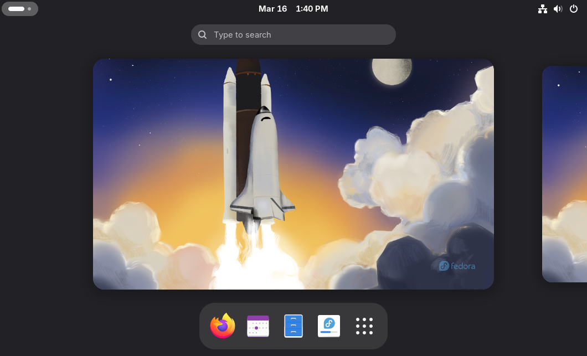
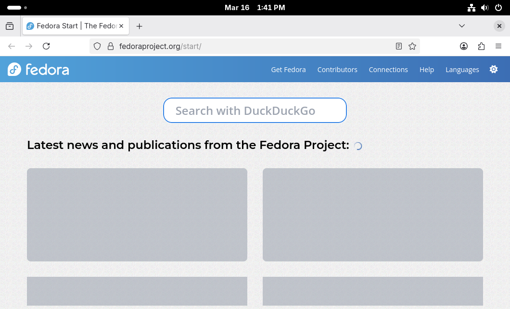
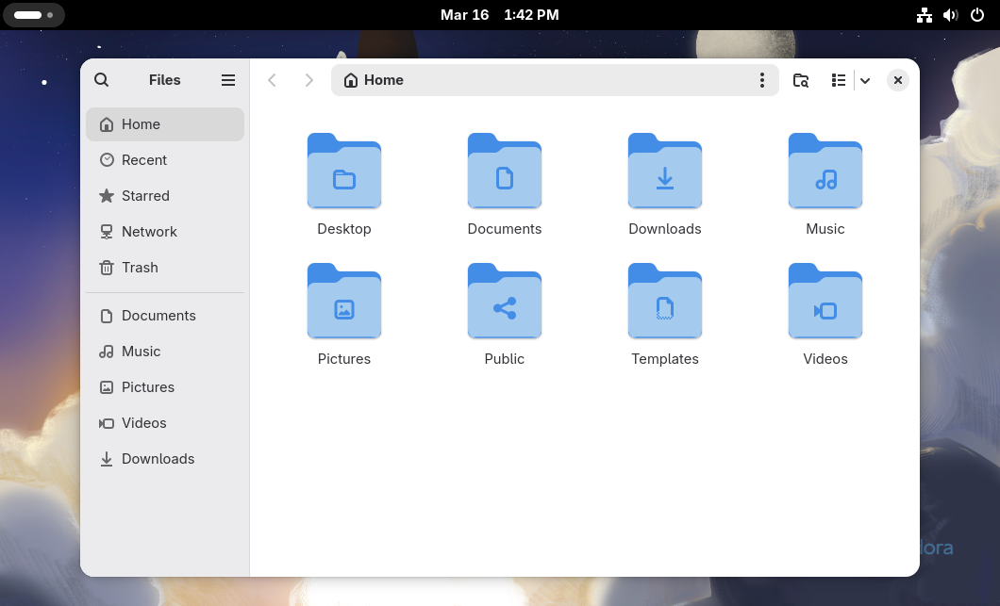
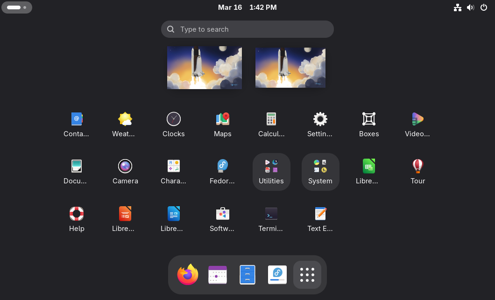
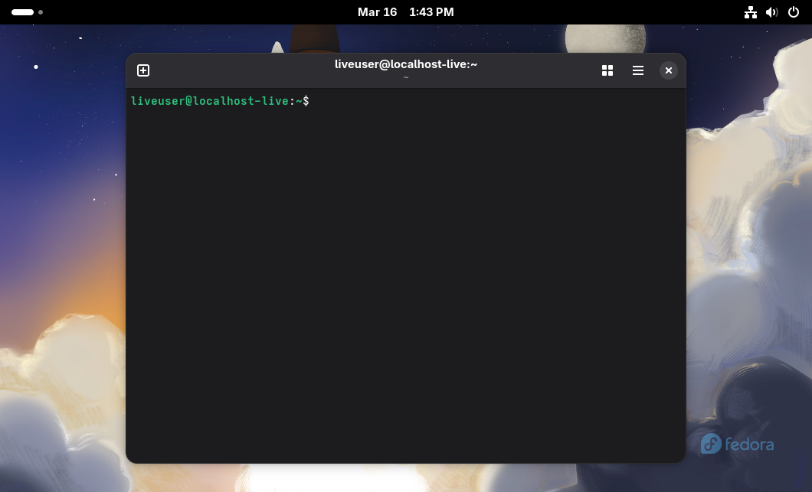
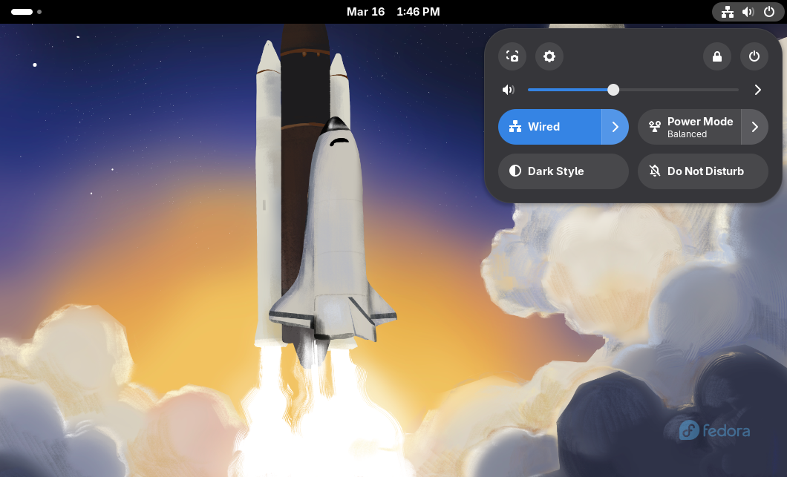

# 🖥️ Manual de Virtualização com Fedora no VirtualBox

## 📚 Disciplina: Sistemas Operacionais  

## 🎯 Objetivo da Atividade

Este manual apresenta o processo completo de instalação e utilização de um ambiente virtualizado utilizando o software Oracle VM VirtualBox e o sistema operacional Fedora Linux.

A atividade consiste em:

- Instalar o VirtualBox
- Criar uma máquina virtual
- Instalar um sistema Linux leve
- Explorar o ambiente virtualizado
- Documentar todo o processo
- Publicar o material no repositório da disciplina

A virtualização permite executar múltiplos sistemas operacionais dentro de um único computador físico, de forma isolada e segura.

---

# 🧠 1. O que é Virtualização?

A virtualização é uma tecnologia que permite criar computadores virtuais dentro de um computador físico.

Esses computadores virtuais são chamados de **Máquinas Virtuais (VMs)**.

Cada máquina virtual possui:

- Sistema operacional próprio
- Memória dedicada
- Disco virtual
- Configurações independentes

Essa tecnologia é muito utilizada para:

- Testar sistemas operacionais
- Criar ambientes de desenvolvimento
- Simular servidores
- Realizar estudos e treinamentos

---

# 💻 2. Requisitos do Sistema

Antes de iniciar o processo de virtualização, é importante verificar se o computador possui os requisitos mínimos.

## 🔧 Hardware recomendado

| Recurso | Requisito mínimo |
|------|------|
| Processador | Suporte a virtualização |
| Memória RAM | 4 GB |
| Espaço em Disco | 20 GB livres |
| Sistema operacional | Windows, Linux ou macOS |

---

## 📦 Software necessário

Para realizar a atividade serão utilizados os seguintes programas:

- Oracle VM VirtualBox
- Imagem ISO do Fedora Linux

A imagem ISO é um arquivo que contém todos os arquivos necessários para instalar o sistema operacional.

---

# ⬇️ 3. Download dos Programas

## 🔽 Baixar o VirtualBox

1. Acesse o site oficial do VirtualBox  
2. Clique na opção **Downloads**
3. Escolha a versão compatível com seu sistema operacional
4. Baixe o instalador

---

## 🐧 Baixar o Fedora

1. Acesse o site oficial do Fedora
2. Escolha a versão **Fedora Workstation**
3. Baixe o arquivo **.ISO**

Esse arquivo será utilizado para instalar o sistema na máquina virtual.

---

# ⚙️ 4. Instalação do VirtualBox

Após baixar o instalador:

1. Execute o arquivo de instalação
2. Clique em **Next**
3. Aceite os termos de uso
4. Mantenha as configurações padrão
5. Clique em **Install**

Durante a instalação podem aparecer avisos sobre drivers de rede virtual.  
Esses drivers permitem que a máquina virtual tenha acesso à internet.

Após finalizar, clique em **Finish** para abrir o programa.

---

# 🖥️ 5. Criando uma Máquina Virtual

Com o VirtualBox aberto:

1. Clique em **Novo (New)**
2. Preencha as informações da máquina virtual.

## 📌 Configurações recomendadas

| Configuração | Valor |
|------|------|
| Nome | Fedora Linux |
| Tipo | Linux |
| Versão | Fedora (64-bit) |

---

## 🧠 Configuração de Memória RAM

A memória RAM define quanto da memória do computador será utilizada pela máquina virtual.

Recomendação:

| Configuração | Valor |
|------|------|
| Memória | 2048 MB |

Caso o computador possua mais memória disponível, esse valor pode ser aumentado.

---

# 💾 6. Criando o Disco Virtual

O disco virtual é o espaço onde o sistema operacional será instalado.

## Configurações recomendadas

| Opção | Configuração |
|------|------|
| Tipo de disco | VDI |
| Armazenamento | Dinamicamente alocado |
| Tamanho | 20 GB |

### Explicação

- **VDI**: formato padrão do VirtualBox  
- **Dinamicamente alocado**: ocupa espaço conforme o uso  
- **20 GB**: suficiente para instalar o sistema e alguns programas

Após finalizar essa etapa, a máquina virtual será criada.

---

# 🐧 7. Instalando o Fedora

Agora será realizada a instalação do sistema operacional.

### Passo 1

Selecione a máquina virtual criada.

Clique em **Iniciar (Start)**.

---

### Passo 2

O VirtualBox solicitará o arquivo de instalação do sistema.

Selecione o **arquivo ISO do Fedora Linux**.

---

### Passo 3

O instalador do sistema será iniciado.

Escolha a opção:

**Start Fedora Workstation**

---

# ⚙️ 8. Processo de Instalação

Durante a instalação do Fedora será necessário:

1. Selecionar o idioma
2. Configurar o teclado
3. Definir o fuso horário
4. Escolher o disco de instalação
5. Iniciar a instalação do sistema

Clique em **Begin Installation**.

O sistema iniciará a cópia dos arquivos.

Esse processo pode levar alguns minutos.

---

# 🔄 9. Reinicialização da Máquina

Após a conclusão da instalação:

1. Clique em **Restart System**
2. Remova o arquivo ISO
3. Inicie normalmente a máquina virtual

Agora o Fedora estará instalado e pronto para uso.

---

# 🔎 10. Explorando o Sistema

Após iniciar o sistema operacional é possível explorar suas funcionalidades.

O Fedora utiliza um ambiente gráfico moderno chamado **GNOME**.

Com ele é possível:

- Abrir aplicativos
- Acessar arquivos
- Utilizar navegador
- Configurar o sistema








---

# 💻 11. Utilizando o Terminal

O terminal é uma ferramenta importante no Linux.

Alguns comandos básicos:

## Listar arquivos

( ```bash
ls )
---
# 🧪 12. Testes Realizados

Durante a exploração da máquina virtual foram realizados alguns testes básicos para verificar se o sistema estava funcionando corretamente.

## Testes executados

- Inicialização da máquina virtual
- Acesso ao ambiente gráfico do sistema
- Abertura do terminal
- Navegação pelo gerenciador de arquivos
- Teste de conexão com a internet
- Atualização do sistema utilizando o gerenciador de pacotes

Todos os testes foram realizados com sucesso, confirmando que a máquina virtual foi configurada corretamente.

---

# ⚡ 13. Vantagens da Virtualização

A virtualização oferece diversas vantagens para estudos, testes e desenvolvimento de sistemas.

## Segurança

Permite testar sistemas operacionais ou softwares sem afetar o sistema principal do computador.

## Isolamento

Cada máquina virtual funciona de forma independente, evitando interferência entre sistemas.

## Aprendizado

Facilita o estudo de diferentes sistemas operacionais sem a necessidade de instalar vários sistemas no computador físico.

## Flexibilidade

Máquinas virtuais podem ser criadas, modificadas ou removidas facilmente conforme a necessidade.

---

# 🧾 14. Conclusão

A realização desta atividade permitiu compreender na prática o funcionamento da virtualização utilizando o software VirtualBox.

Também foi possível instalar e explorar o sistema operacional Fedora Linux, adquirindo conhecimentos importantes sobre criação de máquinas virtuais e instalação de sistemas baseados em Linux.

A virtualização é uma ferramenta essencial na área de tecnologia da informação, sendo amplamente utilizada em ambientes de desenvolvimento, servidores e computação em nuvem.


---

